# AI.SDLC

AI.SDLC is a portable, config-driven workflow harness for AI-assisted software
projects. It turns a changed-file list into a bounded Work Contract, routes the
change to relevant methods and regression packs, records evidence at each
workflow stage, and reports whether the loop is healthy enough to continue.

The harness combines three control layers:

- **JSM** selects the expert methods an agent must actually apply.
- **LEQ** scores the quality of the resulting evidence and workflow behavior.
- **JouleWork** credits verified useful artifacts and penalizes waste or churn.

JSM is not only used at the beginning. It spans `Assess`, `Regress`, and
`Finish`, with a separate required/applied/missing attestation at every stage.
Status is not healthy until that full lifecycle is complete.

For work on this repository itself, read [AGENTS.md](AGENTS.md), the checked-in
[routing configuration](harness.config.json), and the
[test and release plan](docs/test-release-plan.md). They apply this same framework
to the harness, with durable agent responsibility rules and automated checks.

AI.SDLC is project-neutral. Product rules, commands, skill choices, provider
requirements, and external proof belong in the consuming project's
`harness.config.json`.

## Executable Portfolio Traceability

AI.SDLC now includes a strict portfolio ledger, transition gates, and a human
portal. The ledger is the authority for requirements, work, tests, evidence,
approvals, artifacts, releases, blockers, and next actions. LEQ and JouleWork
are deterministically recomputed from those records into
`ops/portfolio-metrics.json`; the portal reads that derived state rather than
asking a person to copy scores.

```text
plan -> numbered user requirements -> functional requirements -> work
     -> required test types -> evidence -> approval -> release -> live proof
```

The public, sanitized example is [`portfolio.ledger.json`](portfolio.ledger.json).
The schema is
[`schemas/portfolio-ledger.schema.json`](schemas/portfolio-ledger.schema.json).
Consumer portfolios containing private products, customer data, or internal
status belong outside this public repository and can still use the same CLI:

```bash
ai-sdlc plan:validate --ledger /private/portfolio.json --stage change
ai-sdlc portfolio:sync --ledger /private/portfolio.json --output /private/portfolio.html --metrics-output /private/portfolio-metrics.json
ai-sdlc portal:serve --ledger /private/portfolio.json --host 127.0.0.1 --port 5190
```

The portal is then available at `http://127.0.0.1:5190/#human-dashboard`.
When a project has recorded work, task scores roll up to project scores and
project scores roll up to the portfolio. Every displayed LEQ, JouleWork, and
release field has an explicit data-quality state: `valid`, `not_applicable`,
`awaiting_inputs`, `stale`, or `error`. Missing inputs name their owner and next
action; they never become zero, a perfect score, or a vague `unknown`.

Work state is separate from data quality. `queued` means priority/capacity has
not opened, `waiting_dependency` names a prerequisite, and `blocked` is reserved
for an evidenced impediment with a clearing action and owner. Passing ledger
validation means only that schema, links, declared states, and freshness rules
are internally consistent; it does not mean every project is complete, tested,
or unblocked.

### Transition Gates

| Gate | What it blocks |
|---|---|
| `change` | Invalid schema, broken traceability, contradictory completion, or a failed scoped task |
| `release` | Incomplete work, missing approvals, wrong artifact hashes, unready rollback, or content claims without comparison evidence |
| `post-deploy` | Missing deployment records or absent evidence-backed production checks |
| `drift` | Stale portfolio, project, metric, release, or dependent aggregate state |

Validation can be scoped to one project, work item, or release. A failed task
blocks its own transition while remaining visible as debt; it does not silently
stop unrelated healthy work.

```bash
npm run plan:validate
node src/cli.mjs plan:validate --ledger portfolio.ledger.json --stage change --project ai-sdlc --work-item WBS-001
node src/cli.mjs plan:validate --ledger portfolio.ledger.json --stage release --project ai-sdlc --release REL-001
npm run plan:drift
```

### Outcome Evidence Is Not Delivery Evidence

A successful build, upload, URL, filename, or checksum proves delivery and
identity. It does not prove that visible, motion, or behavioral content changed.
When a release claims a content change, the release gate additionally requires:

- an exact SHA-256 artifact identity;
- an artifact marked as a `content` revision; and
- passed visual, motion, or behavioral comparison evidence bound to that exact
  artifact.

The negative test suite proves that a delivery-only artifact cannot pass as a
content revision.

### Automation

Install the versioned local hooks once per clone:

```bash
npm run hooks:install
```

The pre-commit hook validates the ledger, requires an accompanying ledger
change when implementation or enforcement files change, recomputes portfolio
metrics, and rejects a stale generated board. The pre-push hook repeats that
sync after behavioral, change, and drift gates. GitHub Actions enforce the same
contract on pull requests and `main`; daily drift runs use the current clock.

Release and deployment automation has two layers:

- `.github/workflows/release-gate.yml` and `post-deploy.yml` are reusable gates
  for consumer pipelines and also audit real GitHub `release.published` and
  successful `deployment_status` events.
- `.github/workflows/publish-release.yml` is the authorized repository release
  path: its publish job depends on the reusable release gate, so invalid
  evidence prevents `gh release create` from running.

After a registered release or deployment event passes, automation updates the
ledger and derived board on an automation branch and opens a pull request. It
does not bypass protected `main`. A deployment can become
`production_proven` only when its production tests and evidence were already
recorded and pass the post-deploy gate.

Repository settings are a separate enforcement layer. Required status checks
and pull-request rules must be configured on `main`; merely committing a
workflow file does not create branch protection.

AI.SDLC is also planning an optional **Vibe Mode** for intentionally fast,
low-ceremony exploration. Vibe Mode will let people prototype and move ideas
around without running the full gated lifecycle, while keeping that work
clearly marked as experimental. Ungated work will not be representable as
verified, release-ready, or production-proven until it re-enters the standard
traceable workflow. The planned boundary and acceptance criteria are tracked in
[`docs/project-plan.md`](docs/project-plan.md).

## How The Harness Works

```mermaid
flowchart LR
    JA["JSM: Assess methods"] --> A["Assess: Work Contract and routing"]
    A --> JR["JSM: Regress methods"]
    JR --> R["Regress: protected machine and external proof"]
    R --> JF["JSM: Finish methods"]
    JF --> F["Finish: evidence-bound closure"]
    F --> L["LEQ: loop-evidence quality"]
    L --> W["JouleWork: useful work minus waste"]
    W --> S["Status, Markdown, and dashboard guardrails"]
```



### 1. Assess

`ai-sdlc assess` answers: “Given these files and this proposed deliverable,
which controls apply?”

It:

1. normalizes the file list;
2. matches every file against configured surfaces;
3. unions the matching risk classes and protected packs;
4. routes JSM skills separately for Assess, Regress, and Finish;
5. verifies that every routed skill package has a `SKILL.md`;
6. requires explicit `--applied-skill` evidence for the Assess-stage methods;
7. records the Work Contract and later-stage JSM requirements; and
8. writes `ops/change-impact.latest.json`.

Missing skill packages or missing Assess attestations produce a blocked
artifact and a nonzero exit. Package presence alone is not treated as proof
that an agent applied the method.

### 2. Regress

`ai-sdlc regress` answers: “Did the change satisfy its protected checks, and
what proof is still external?”

It:

1. uses the supplied files or the latest Assess file set;
2. independently routes and attests Regress-stage JSM methods;
3. executes the selected pack commands in the project root;
4. records command, status, exit code, and elapsed time;
5. preserves human/provider/visual proof as explicitly pending; and
6. writes `ops/protected-regression.latest.json`.

A missing Regress JSM method fails the regression and skips protected commands;
the checks do not run until the required method is attested.

### 3. Finish

`ai-sdlc finish` answers: “Can this exact file set be closed from current
evidence?”

Finish does not silently recreate earlier JSM evidence. It requires current
Assess and Regress artifacts bound to the exact intentional file set, then
independently requires the Finish-stage methods through `--applied-skill`.
Stale, mismatched, blocked, failed, or incomplete stage evidence prevents
closure.

By default, Finish records an evidence-only checkpoint. With `--execute`, it
can stage only the intentional files, commit them, and push the current branch.
Use `--skip-git` when Git mutation is not authorized. Product deployment is not
part of this portable harness.

Finish writes `ops/iteration-finish.latest.json` and refreshes status only
after that artifact exists, so the status view includes the current Finish JSM
attestation.

### 4. Refresh And Status

`ai-sdlc refresh` rebuilds:

- `ops/status.json`;
- `docs/status.md`; and
- `ops/dashboard.html`.

`ai-sdlc status` reads the current status and prints a compact summary.
Refresh aggregates the three JSM attestations but does not invent or
auto-complete them.

## JSM Across Workflows

Skills are assigned by file surface and stage:

```json
{
  "id": "docs",
  "filePatterns": ["README.md", "docs/**"],
  "riskClasses": ["docs"],
  "packs": ["docs"],
  "skills": [
    {
      "name": "readme-writing",
      "stages": ["Assess"]
    },
    {
      "name": "reality-check-for-project",
      "stages": ["Regress"]
    },
    {
      "name": "codebase-report",
      "stages": ["Finish"]
    }
  ]
}
```

The same skill may appear in more than one stage when its method genuinely
applies more than once. Different surfaces are unioned, so a mixed code,
documentation, and UI change may require several methods at each stage.

For backward compatibility, a string entry such as `"readme-writing"` means
that the skill is required during Assess only. New configurations should use
the explicit `{ "name", "stages" }` form.

The default skill roots are:

- `~/.claude/skills`;
- `~/.codex/skills`;
- `~/.agents/skills`.

They can be overridden for a project or test fixture:

```json
{
  "jsm": {
    "skillRoots": [".project-skills", "~/.codex/skills"]
  }
}
```

Each root is expected to contain `<skill-name>/SKILL.md`.

### Official JSM Dependency Collection

AI.SDLC carries a metadata-only lock for the complete official JSM collection.
At the time of the current lock, that is 135 named, versioned, integrity-bound
skills. The lock is `jsm/official-skills.lock.json`.

Premium skill bodies are not copied into this repository. Jeffrey's Skills.md
identifies them as proprietary works and prohibits redistribution outside its
service. An authorized subscriber installs them locally through `jsm`, while
AI.SDLC verifies the installed names, versions, and deterministic package
hashes against the committed lock.

Install the complete locked collection:

```bash
ai-sdlc skills:install
```

Verify an existing installation without modifying it:

```bash
ai-sdlc skills:verify
```

Both commands fail closed when `jsm` is missing, too old, unauthenticated, a
locked package is absent, a version differs, or package integrity differs.
`skills:install` first uses the official `jsm install-all` operation and then
pins any version that differs from the lock.

This separation is deliberate:

- AI.SDLC owns routing, lifecycle gates, the dependency lock, and verification.
- JSM owns authentication, licensed delivery, version installation, and package
  integrity.
- The consuming project owns its configured skill selection and any
  project-specific overlay.

See the [JSM service](https://jeffreys-skills.md/) and its
[terms](https://jeffreys-skills.md/terms) for subscription and usage
requirements.

## LEQ And JouleWork

LEQ and JouleWork are active guardrails, not decorative report fields.

LEQ begins from a nominal healthy score and records deductions for conditions
such as:

- missing or stale required documents;
- open Git changes;
- `TODO` or `FIXME` debt;
- missing or failed protected regression;
- a failed or blocked Finish checkpoint; and
- an incomplete JSM lifecycle.

JouleWork is a labeled `JW_proxy`, not measured physical energy. It credits
the change-impact, protected-regression, and Finish artifacts, plus one
additional useful-work unit when the complete JSM lifecycle is present. It
then applies waste penalties for documentation debt, uncommitted churn, task
markers, low LEQ, and incomplete JSM.

This creates a real dependency:

```text
stage-specific JSM evidence
  -> protected claim evidence
  -> LEQ quality score
  -> useful-work and waste accounting
  -> JouleWork
  -> healthy or attention status
```

With the default thresholds, status is healthy only when:

- all required JSM stages are complete;
- LEQ is at least `85`; and
- JouleWork is at least `70`.

A command passing does not erase external proof debt, and a healthy metric does
not imply human acceptance, production readiness, profitability, or deployment
approval.

### Portfolio rollups

The portfolio board uses a separate, transparent `traceability-v2` rollup so
task, project, and portfolio health can be refreshed without hand-entered
scores:

- task traceability LEQ weighs requirement linkage (20), required test-type
  declaration coverage (15), the pass ratio across every declared check plus
  every undeclared required verification type (35), passed-check evidence
  linkage (20), and blocker-free state (10), with explicit failure/blocker
  penalties;
- task traceability JouleWork weighs requirement linkage (20), that same
  verification-obligation pass ratio (30), passed-check evidence (25), and
  completed useful work (25), with the same penalties;
- project scores average applicable task records, and the portfolio averages
  applicable projects only when every dependent input is valid and uses the
  same named metric model;
- stale, error, or awaiting child state invalidates its dependent aggregate;
- projects without recorded work use an explicit reported source or state why
  the metric is not applicable, which inputs are awaited, or what failed.

Every valid or stale score names its metric model, exact formula, denominator,
pending checks, source, scope, and observation time. Evidence freshness comes
from the oldest contributing observation, not from the time the dashboard was
regenerated or unrelated project metadata was edited. A planned duplicate test
cannot disappear behind another passing test of the same type, and a missing
required verification type remains an unmet denominator obligation.

These portfolio values are evidence-coverage proxies, not scientific energy,
engineering efficiency, business outcome, release completion, or the harness's
separate lifecycle LEQ/JW_proxy. The lifecycle model begins from 100 and applies
documented debt penalties; lifecycle JouleWork credits up to four useful
artifacts at 20 points each and subtracts waste. The portal keeps lifecycle and
traceability families separate rather than averaging or relabeling them. Release,
publication, deployment, and production proof remain explicit adjacent states.

`npm run portfolio:sync` regenerates both `ops/portfolio-metrics.json` and
`ops/portfolio-dashboard.html`. Local hooks, pull-request CI, `main` CI, and the
daily drift workflow reject generated files that do not match the ledger.

## Install

```bash
git clone https://github.com/VermontForest/AI.SDLC.git
cd AI.SDLC
npm install
npm link
ai-sdlc skills:install
ai-sdlc skills:verify
```

Initialize a consuming project:

```bash
cd /path/to/project
ai-sdlc init --project-name "My Project"
```

Add convenient scripts to that project:

```json
{
  "scripts": {
    "assess:change-impact": "ai-sdlc assess",
    "regress:protected": "ai-sdlc regress",
    "finish:iteration": "ai-sdlc finish",
    "manage:status": "ai-sdlc status",
    "manage:refresh": "ai-sdlc refresh",
    "manage:metrics:test": "ai-sdlc self-test"
  }
}
```

## Daily Use

Agents own tool discovery, documentation reading, and authorized routine setup,
troubleshooting, edits, and commands. Carl is not the assistant's assistant.
Investigate available capabilities and permitted alternatives before declaring a
blocker. Ask only for an essential user-owned decision or action, such as
authentication or consent inaccessible to tools, with a specific explanation.
See the [generated operating contract](templates/AGENTS.sdlc.snippet.md).

Start a mixed code/documentation change with the methods selected for Assess:

```bash
npm run assess:change-impact -- \
  --files src/a.ts docs/b.md \
  --active-deliverable "Ship the thing" \
  --why "User-visible value" \
  --target-surface app \
  --lane full-sdlc \
  --applied-skill planning-workflow,readme-writing \
  --boundary "No production promotion" \
  --proof "npm test" \
  --verifier-required
```

Run protected checks with the Regress methods:

```bash
npm run regress:protected -- \
  --files src/a.ts docs/b.md \
  --applied-skill testing-real-service-e2e-no-mocks
```

Close the exact file set with the Finish methods and no Git mutation:

```bash
npm run finish:iteration -- \
  --intentional-files "src/a.ts,docs/b.md" \
  --applied-skill reality-check-for-project,codebase-report \
  --skip-git
```

When an intentional commit and push are authorized:

```bash
npm run finish:iteration -- \
  --intentional-files "src/a.ts,docs/b.md" \
  --applied-skill reality-check-for-project,codebase-report \
  --execute \
  --commit-message "Ship the thing"
```

Refresh the human-readable views:

```bash
npm run manage:refresh
```

Then open `ops/dashboard.html`.

Before claiming completion, verify the actual dependencies and current lifecycle:

```bash
ai-sdlc verify-completion --intentional-files "src/a.ts,docs/b.md"
```

This read-only command returns nonzero for missing licensed dependencies,
incomplete or mismatched stage evidence, changed tested contents or configuration,
pending external proof, or unhealthy LEQ/JouleWork. It never creates missing
attestations. Reassess changed scope/configuration; rerun Regress and Finish after
editing tested contents. Assess requires a complete Work Contract (deliverable,
why, surface, lane, boundaries, proof; verifier requirement defaults to false).
Skipped regression commands and optional-pack-only runs cannot satisfy Finish.
Blocked Finish now returns a nonzero exit code.

### Updating existing installations

Use repository name `AI.SDLC`, package and command `ai-sdlc`, launcher
`bin/ai-sdlc.mjs`, and template `templates/AGENTS.sdlc.snippet.md`. Update local
remote URLs and consuming-project scripts/dependencies, reinstall or relink the
package, and review the revised agent/SOP templates. Existing AGENTS.md files are
preserved by `init`; merge the updated contract into them deliberately. There are
no misspelled CLI aliases. A repository rename preserves its Git history and
access; repository redirects do not rename installed commands.

## File List And Skill Parsing

All file-list forms are accepted:

```bash
--files src/a.ts docs/b.md
--files src/a.ts --files docs/b.md
--files "src/a.ts,docs/b.md"
```

Applied skills may be comma-separated or repeated:

```bash
--applied-skill planning-workflow,readme-writing
--applied-skill planning-workflow --applied-skill readme-writing
```

Text flags such as `--active-deliverable`, `--why`, `--boundary`, and
`--proof` collect multi-word values until the next flag.

## Configuration

The routing authority is `harness.config.json`.

- `surfaces` map file globs to risk classes, protected packs, and staged skills.
- `packs` define machine commands and optional external proof.
- `jsm.skillRoots` optionally overrides skill-package search roots.
- `artifacts` controls every generated artifact path.
- `docs.required` defines documentation-health inputs.
- `metrics.targets` controls LEQ and JouleWork health labels.
- `metrics.taskMarkerGlobs` controls the files scanned for task debt.

See [templates/harness.config.example.json](templates/harness.config.example.json)
and [schemas/harness-config.schema.json](schemas/harness-config.schema.json).

Treat configuration commands as executable code. Review config changes with
the same care as source changes.

Legacy `metrics.thresholds` configurations remain readable; new configurations
use `metrics.targets`.

## Files Needed To Instantiate The Harness

There are three useful inventory levels.

### Runtime package

These files are needed to run the published CLI itself:

| File | Purpose |
|---|---|
| `package.json` | Package metadata, commands, Node requirement, and CLI entry |
| `bin/ai-sdlc.mjs` | Executable launcher |
| `src/cli.mjs` | Command dispatch and help |
| `src/process.mjs` | Real child-process execution and Windows-compatible output capture |
| `src/core.mjs` | Routing, JSM gates, regression, Finish, LEQ, JouleWork, status, and self-test |
| `src/jsm-dependencies.mjs` | Licensed JSM installation, locked-version verification, and lock maintenance |
| `jsm/official-skills.lock.json` | Metadata-only inventory of every official JSM skill, version, and deterministic hash |
| `templates/harness.config.example.json` | Default project configuration |
| `templates/AGENTS.sdlc.snippet.md` | Agent operating contract installed by `init` |
| `templates/docs/management-sop.md` | Management-loop documentation template |
| `templates/docs/test-release-plan.md` | Proof and release documentation template |

`package-lock.json` is needed for reproducible development installation. The
schema, README, and example project are strongly recommended but are not
runtime imports.

### Minimum consuming project

A project using an installed AI.SDLC package needs:

| File or dependency | Required role |
|---|---|
| `harness.config.json` | Project-specific surfaces, staged JSM methods, packs, artifacts, docs, and thresholds |
| The files named by every configured pack command | Real project tests and validation commands |
| `<skill-root>/<skill-name>/SKILL.md` for every routed method | JSM package presence |
| An authorized `jsm` installation matching `jsm/official-skills.lock.json` | Licensed delivery and integrity of the complete official dependency collection |
| Node.js 22 or newer | CLI runtime |

Package scripts are convenient but optional; direct `ai-sdlc` commands work.

### Controlled, shareable project setup

For a durable team workflow, also keep:

- `AGENTS.md` with the AI.SDLC operating contract;
- `docs/management-sop.md`;
- `docs/test-release-plan.md`;
- numbered requirements and traceability artifacts appropriate to the project;
- real test/QC commands referenced by protected packs; and
- a Git repository if Finish will create checkpoints.

Generated `ops/*.json`, `docs/status.md`, and `ops/dashboard.html` are runtime
state. They should be generated in the destination project rather than copied
from another project's history.

## Generated Evidence

The default artifact set is:

| Artifact | Meaning |
|---|---|
| `ops/change-impact.latest.json` | Work Contract, matched surfaces, all routed skills by stage, Assess attestation, packs, and risks |
| `ops/protected-regression.latest.json` | Regress JSM attestation, protected check results, failures, and pending external proof |
| `ops/iteration-finish.latest.json` | Finish JSM attestation, exact file binding, closure result, and optional Git checkpoint |
| `ops/status.json` | Machine-readable aggregate state, JSM lifecycle, LEQ, JouleWork, docs, and Git health |
| `docs/status.md` | Human-readable status |
| `ops/dashboard.html` | Standalone human dashboard |

The `*.latest.json` files are rolling workflow state, not an immutable evidence
ledger or cryptographic attestation. A consuming project that needs regulated
or release-grade claims should add versioned manifests and a stronger claim
gate as protected packs.

## Verification

`npm test` runs the repository contract validator and real temporary-project
self-test. GitHub Actions runs it on Windows/Linux with Node 22/24. Hosted action
execution uses current pinned `actions/checkout` and `actions/setup-node` v7
commits; that action runtime is distinct from the application compatibility
matrix. Dependabot checks both Actions and npm dependencies weekly. The validator
checks canonical spelling, package entry points, locked staged skill routing,
protected test commands, and durable responsibility guidance. No premium skill
bodies are distributed in CI. Fixture attestations test the harness; actual
completion still requires the separate licensed `verify-completion` gate.

Run the built-in no-mock self-test:

```bash
npm test
```

Verify the real locally installed JSM dependency collection:

```bash
npm run jsm:verify
```

The self-test creates a real temporary project, real skill packages, real
project files, and real shell-command packs. It proves:

- file-to-surface and pack routing;
- stage-specific JSM selection;
- fail-closed Assess, Regress, and Finish behavior;
- chained shell-command execution;
- exact Finish evidence binding;
- blocked Finish exit codes, skipped/partial regression rejection, and stale
  tested-content rejection;
- complete Work Contracts and the read-only completion evidence gate;
- complete JSM aggregation in status;
- LEQ participation; and
- productive JouleWork after a complete useful-work chain.

The portfolio tests additionally prove:

- schema and trace-link failures block;
- required test classes and evidence are enforced;
- a failed scoped task blocks itself without blocking an unrelated task;
- queued, dependency-waiting, and genuinely blocked work remain distinct;
- blocked work must name an impediment, clearing action, and owner;
- missing, stale, and dependent metric inputs cannot become invented scores;
- release state distinguishes not applicable, awaiting publication, recorded,
  and production-proven evidence;
- approvals, rollback, deployment, and production proof are stage-specific;
- incorrect artifact hashes block release;
- delivery-only artifacts cannot masquerade as content changes;
- stale projects and metrics fail the drift gate; and
- the responsive portal is generated from the validated ledger.

## Trust Boundaries

### Codex lifecycle guardrails (opt-in per project)

`src/codex-hooks.mjs` implements local-only startup context, pre-edit admission,
and bounded completion checks; run `npm run test:hooks` for the real-filesystem
positive/negative tests. Install the global agreement from
`templates/codex-global-AGENTS.md` without overwriting existing instructions.
Deploy the runtime to a content-hash-named directory outside project worktrees
and reference that exact absolute Node/script pair from Codex `hooks.json` for
`SessionStart`, `SubagentStart`, `PostCompact`, `PreToolUse`, and `Stop`.
Changing deployed bytes requires a new path and renewed hook-definition review.
Never edit Codex trust storage or bypass its trust check to claim activation.

A consuming project's existing `harness.config.json` opts in using `lifecycle`
schema version 1, `maxAssessmentMinutes`, `maxMetricMinutes`, `metrics` (JSON
paths with `generated_at`), `claimGate`, `remote`, optional `nestedRepositories`,
and explicit local `knowledgeRoots`. Its assessment producer must provide
`execution_context: {root, head, work_id}` plus the complete outcome contract.
Its claim gate must emit the current `manifest_sha256` as well as work identity.
The manifest's `lifecycle` contains exact changed `source_hashes`, per-required-
skill `skill_application` entries (`skill`, `skill_sha256`, `action`, hashed
`evidence` paths), `knowledge_update` (`updated` with hashed paths, or justified
`not_applicable`), and `no_claim`. These extend existing project evidence; they
are not a new project-management store. Skill attestations and hashed outputs
still do not establish the quality of the agent's reasoning.

The configured assessment, regression and claim-gate artifacts and the gate's
hash-bound manifest are validated by their exact proof roles; they must not
contain their own source hashes. Optional `lifecycle.claim_receipts` lists JSON
copies of that gate used for private checkpointing. Every canonical gate field
must match exactly; only proof-pack, claim-level and validation-result metadata
may be added. Ordinary source files still require exact source hashes. The
positive Git-fixture test includes these assessed receipts and rejects a
tampered copy, avoiding circular manifest/receipt hashing.

Unenrolled locations get a visible warning, not an unapproved global lockdown.
Hosted tools and some specialized tools are outside hook coverage; the current
pre-edit policy covers shell and apply_patch only. Shell admission is a
conservative heuristic, not a complete PowerShell parser. An assessed shell
program is not restricted to the assessed file list. Direct patch admission
requires exact files; directories and submodule gitlinks need their own project
proof path and are refused by this version. An assessed shell
program can still perform indirect actions: independent permissions and
server-side promotion checks remain necessary for a security boundary.
The stop check requests at most one recovery continuation, then reports partial
status; it must not create an infinite paid loop. Tests retain their temporary
Git repositories. No prompts, transcripts, commands, tool results, or project
file contents are uploaded or written to the metadata-only hook audit.

AI.SDLC does not decide whether product logic is correct. It coordinates the
checks that the consuming project declares and records their results.

It also does not:

- turn an explicit skill attestation into proof of reasoning quality;
- satisfy visual, provider, account, customer, or human acceptance evidence;
- deploy a product;
- provide credentials;
- make financial, safety, profitability, or production-readiness claims; or
- make rolling `latest` artifacts tamper-evident.


## License

This repository is released under the MIT License. See [LICENSE](LICENSE).

Jeffrey's Skills.md packages remain separate proprietary works. An authorized subscriber installs them through `jsm`. This repository redistributes only the metadata lock in `jsm/official-skills.lock.json`, not premium skill bodies. See https://jeffreys-skills.md/terms.

## What Not To Commit To This Repository

Do not commit live consumer-project state here:

- `ops/*.latest.json`;
- `ops/status.json`;
- `ops/dashboard.html`;
- secrets or provider tokens;
- premium JSM `SKILL.md` bodies or their reference/script payloads;
- customer data;
- private product rules or evidence; or
- production deployment artifacts.

Commit schemas, templates, generic implementation, examples, and scrubbed test
fixtures only.
